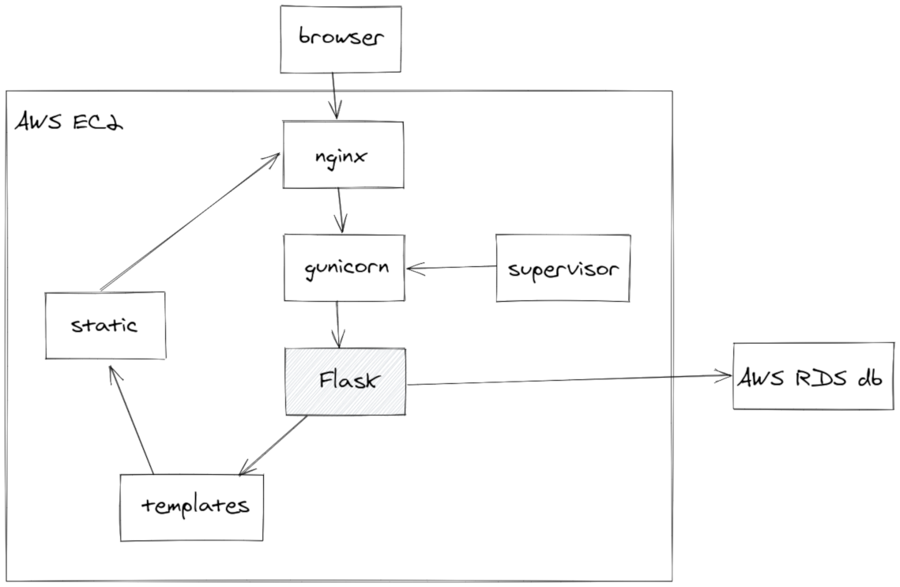

# flask-deploy

Projeto de teste para deploy de uma aplicação Flask.

## Instalar e rodar o projeto

### Rodando o Flask localmente

```
pipenv shell
pipenv sync
flask run  # rodando Flask na porta default, 5000
```

Definindo uma porta e um host de conexão.

```
flask run -p 5000 -h 0.0.0.0
```

### Rodando com gunicorn

[Doc gunicorn](https://gunicorn.org/#docs)

Coloque o gunicorn no Pipfile e reinstale.

Em seguida rode com gunicorn.

```
gunicorn -b 0.0.0.0:5000 app:app
```

Agora a app está rodando em http://0.0.0.0:5000

Pronto! Agora vamos fazer o deploy em produção.


## Atualização rápida no servidor

Quando você fizer alguma alteração no código e fizer deploy novamente.

* Entre no servidor

`ssh -i ~/.ssh/sua-chave.pem ubuntu@IP`

* Entre na pasta `app`

`cd app`

* Faça pull

`git pull`

* Reinicie o supervisor

`make restart_supervisor`


... continuando com a explicação do passo a passo de configuração de servidor e do deploy.

Mas antes vamos criar dois arquivos para versionar:

### Arquivo de configuração para nginx

```
mkdir nginx
touch nginx/nginx.conf

```

Editando nginx.conf

```
server {
    listen       80;
    server_name  127.0.0.1;
    charset utf-8;

    location / {
        proxy_pass http://127.0.0.1:5000;
        proxy_set_header X-Forwarded-For $proxy_add_x_forwarded_for;
        proxy_set_header X-Forwarded-Proto $scheme;
        proxy_set_header Host $http_host;
        access_log /home/ubuntu/app/logs/nginx-access.log;
    }

    location /static {
        alias /home/ubuntu/app/static;
    }
}
```
### Arquivo de configuração para supervisor

```
mkdir supervisor
touch supervisor/supervisor.conf
```

Editando supervisor.conf

```
[program:webapp]
user=ubuntu
directory=/home/ubuntu/app
command=/usr/bin/pipenv run gunicorn -b 0.0.0.0:5000 app:app
autostart=true
autorestart=true
redirect_stderr=True
stderr_logfile=/home/ubuntu/app/logs/webapp.err.log
stdout_logfile=/home/ubuntu/app/logs/webapp.out.log
```

Lá no servidor, pra descobrir o /path/to você precisa rodar o comando a seguir, já que estamos usando pipenv.

`which pipenv`

... na verdade não vamos mais precisar disso.


## Deploy

Entendendo a arquitetura do projeto.



### Clonando o projeto no servidor

```
git clone https://github.com/rg3915/flask-deploy.git app
```

Repare que chamamos a pasta de `app`. Vai ficar mais fácil de trabalhar.

Em seguida, entre na pasta

```
cd app
mkdir logs     # pasta para os logs
pipenv shell   # neste projeto estamos usando pipenv
pipenv sync
flask run -p 8000 -h 0.0.0.0  # rodando Flask na porta 8000 (que está liberado)
```

Estou considerando que você já instalou tudo sobre Python3 e pipenv.

Não instalou? Então vamos lá.

## Instalando pyenv

### Instalando Python 3.8.3

```
sudo apt update
sudo apt -y upgrade

# install packages
sudo apt-get install -y make build-essential libssl-dev zlib1g-dev libbz2-dev libreadline-dev libsqlite3-dev llvm libncurses5-dev

# install pyenv
curl https://pyenv.run | bash

sudo vim ~/.bashrc

export PATH="$HOME/.pyenv/bin:$PATH"
eval "$(pyenv init -)"
eval "$(pyenv virtualenv-init -)"

source ~/.bashrc

pyenv install -l
pyenv install 3.8.3
pyenv versions
pyenv global 3.8.3
pyenv versions
python -V
```

## Instalando pipenv

```
sudo apt install -y pipenv

# ou

pip install pipenv

pyenv local 3.8.3       # para usar a versão específica do Python
```

Umas coisinhas que eu gosto de fazer no servidor:

## Crie alguns alias dentro do `~/.bash_profile`

```
cat << EOF > ~/.bash_profile
alias l='clear; ls -lF'
alias rm='rm -i'
alias h=history
alias python=python3
alias pip=pip3
# Git
alias g='git'
alias gp='git push origin HEAD'
EOF
```

E faça

`echo "source ~/.bash_profile" >> ~/.bashrc`

seguido de `source ~/.bashrc`


### Vim

Se quiser configure seu `~/.vimrc` para usar 4 espaços.

https://stackoverflow.com/questions/234564/tab-key-4-spaces-and-auto-indent-after-curly-braces-in-vim/234578#234578

Eu gosto de deixar minha configuração assim:

```
set encoding=utf-8
set number          " show line numbers
set expandtab       " use spaces instead of tabs
set autoindent      " autoindent based on line above
set smartindent     " smarter indent for C-like languages
set shiftwidth=4    " when using Shift + > or <
set softtabstop=4   " in insert mode
set tabstop=4       " set the space occupied by a regular tab
```

Eu tenho um `.vimrc` mais completo em

https://gist.github.com/rg3915/57b489c1751c384b3ad614c492478df0


### Instalando o nginx

[nginx](https://nginx.org/en/docs/) é o proxy reverso. Basicamente significa que toda requisição do browser deve passar por ele.

```
sudo apt install -y nginx
```

Para verificar se o nginx está rodando

```
systemctl status nginx
```

Para ativar um novo serviço do nginx no Linux, pra voltar a funcionar mesmo que a máquina seja reiniciada.

```
sudo systemctl enable nginx
```

Veja o que tem na pasta a seguir

```
ls -l /etc/nginx
cd /etc/nginx/sites-available/
cat default
```

Agora copie `nginx.conf` (que está na pasta do projeto), renomeando para `webapp`.

```
sudo cp /home/ubuntu/app/config/nginx/nginx.conf /etc/nginx/sites-available/webapp
```

Agora vamos criar o link simbólico em `sites-enabled`

```
cd /etc/nginx/sites-enabled/
sudo ln -s /etc/nginx/sites-available/webapp /etc/nginx/sites-enabled/
```

E se quiser, pode remover o `default`

```
sudo rm -f /etc/nginx/sites-available/default
sudo rm -f /etc/nginx/sites-enabled/default
```


#### Reiniciar o nginx

Antes você pode testar o nginx com o comando

```
sudo nginx -t
```

Reiniciando

```
sudo service nginx restart
```

Rode a aplicação novamente com

```
cd ~/app

gunicorn -b 0.0.0.0:5000 app:app
```

Pronto! Já temos a aplicação rodando na porta **80**. É isso mesmo, o **nginx redireciona** a porta 5000 para a porta 80, que no caso é a "porta externa" da aplicação para acesso ao público.

Garanta que esta porta esteja liberada para acesso na sua cloud.


#### Monitorando o log do nginx

```
tail -f /home/ubuntu/app/logs/nginx-access.log
```

Para conferir se os arquivos estáticos estão passando pelo nginx inspecione elementos no navegador

```
Response > Headers
Server: nginx/1.16.1 (Ubuntu)
```


### Instalando o Supervisor

[Supervisor](http://supervisord.org/) é o serviço que restarta e gerencia os processos do gunicorn. Ou seja, ele "liga" o gunicorn mesmo que você dê boot no servidor.


```
sudo apt install -y supervisor
```

Links: https://medium.com/@luciohenrique/realizando-o-deploy-com-python-django-virtualenv-gunicorn-systemd-nginx-https-221a1424763d

Copie o arquivo `supervisor/supervisor.conf` para o lugar correto e renomeie para `webapp.conf`

```
sudo cp /home/ubuntu/app/config/supervisor/supervisor.conf /etc/supervisor/conf.d/webapp.conf
```

```
sudo supervisorctl status
sudo systemctl status supervisor    # gerenciar processos no Linux
sudo systemctl enable supervisor    # ativar o supervisor no servidor
sudo supervisorctl reread           # relê os arquivos de configuração do supervisor
sudo supervisorctl update           # atualiza
sudo service supervisor restart webapp
sudo systemctl status
sudo supervisorctl status
```

Se der algum erro é porque você esqueceu de colocar o `user=ubuntu` em `webapp.conf`.

E

```
sudo supervisorctl reread
sudo supervisorctl update
sudo supervisorctl restart webapp
sudo supervisorctl status
```

Conferindo as portas de conexão.

```
lsof -i :5000
```

Seu deploy está pronto!

